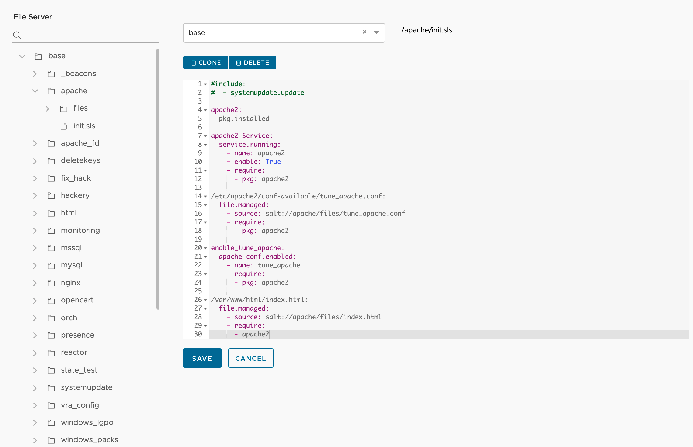

Welcome to the File Server Page

The File Server section is where you can create state files to manage your infrastructure. You can post .sls files, scripts, configuration files and files that you may want to distribute to minions. You can also create them in a variety of scripting languages such as YAML, python, json etc. These files can be accessed via jobs or ad-hoc commands from within SaltStack Config. 

The File Server consists of <a href="https://docs.saltproject.io/en/latest/topics/tutorials/starting_states.html">state files</a> that declare the configuration of your infrastructure. To learn more about State Files click on this link.

When you create state files within this secion they are stored in the SaltStack Config postgres database. The file server also provides a tree like structure to place files and then they can be called by other state files. For instance if you have a state file pushed a configuration file down to a minion the state could look something like this:
 
 

Basically the line of code above instructs Salt to push that file down and the source starts with salt:// because that points to the <i>base</i> file roots location within the File Server tree structure. You can store config files in the file server then push them down to the minion, or call scripts via <a href="https://docs.saltproject.io/en/latest/ref/states/all/salt.states.cmd.html"><i>cmd.script</i></a> command to locally execute a script that is stored in the File Server.

When you create state files you can then create jobs to run them. Within the Config sections there is a Jobs link where you can go to create jobs. 

If you look at the top of the File Server page you will see a dropdown that points to environments then a path section. 
 

 
 
The dropdown will allow you to choose an environment or you can create your own by typing in a new name. This will allow you to seperate out various environments in how you structure you state files. You may have a Dev section or a Prod section. 

The path is the folder and file name where you want to store the file. So in example above the init.sls file will be created in the /base/apache folder.

You can also run these state files from the CLI on the salt master that is connected to the SaltStack Config via the eAPI Plugin. From the CLI you can run a remote execution commmand to run the state file:

<i>salt '*' state.apply apache saltenv=dev test=True</i>

There are some state file examples and tips here as well <a href="https://blogs.vmware.com/management/2021/06/getting-started-with-saltstack-config-part-1-creating-state-files.html">Getting Started with SaltStack Config: State Files Blog</a>

